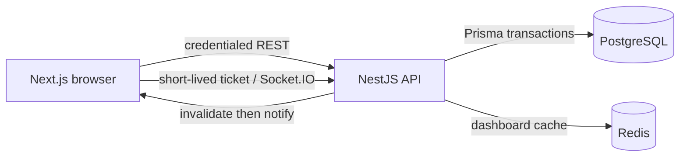

# ForgeBoard

A working portfolio demo of a multi-tenant project management application. Explore a populated workspace, organize projects on Kanban boards, assign tasks, and discuss work with a fictional team.

## Implemented experience

- One-click demo sign-in as Alex Morgan; expiring signed HttpOnly cookie sessions.
- Protected workspace UI and API membership checks on every tenant-scoped route.
- Responsive dashboard with database-backed project progress, task status counts, personal assignments, due dates, and activity.
- Workspace switcher, project/task search, collapsible navigation, and user menu.
- Create, edit, archive, and restore projects. Archived boards are read-only.
- Kanban cards with priorities, due dates, assignees, comments, and persistent ordering.
- Desktop drag-and-drop plus status selectors and up/down controls for keyboard and touch users.
- Task detail dialogs with editing, deletion, comments, and activity history.
- Redis dashboard caching with a short TTL and mutation invalidation; database fallback when Redis is unavailable.
- Authenticated, workspace-scoped realtime refresh over Socket.IO for task, comment, and project changes.

All seeded people, organizations, and content are fictional demo data. Counts and progress in the application come from the API, not hard-coded metrics. Payments, AI, admin systems, and production identity are intentionally out of scope. Deployment is not live yet.

## Stack and structure

| Area     | Stack                                                                              |
| -------- | ---------------------------------------------------------------------------------- |
| Frontend | Next.js 16 App Router, React 19, strict TypeScript, Tailwind CSS 4, TanStack Query |
| Backend  | NestJS 12, REST, Socket.IO, class-validator DTOs, centralized errors               |
| Database | PostgreSQL 17, Prisma 6.19, checked-in SQL migration                               |
| Cache    | Redis 7, node-redis                                                                |
| Tooling  | pnpm 10.33, Turborepo, ESLint, Prettier                                            |
| Tests    | Node test runner, Nest testing utilities, Socket.IO client, Playwright             |

```text
apps/
  web/                 App Router pages, UI, query layer, browser tests
  api/
    src/               auth, workspaces, projects, tasks, cache, database
    prisma/            schema, migrations, deterministic seed
    test/              health, auth/validation, service tests
packages/
  ui/                  Reusable React primitives
  types/               Shared API response contracts
  config/              TypeScript and ESLint configuration
docs/architecture.md
docker-compose.yml
.env.example
```

## Prerequisites

- Node.js 22.12+ on the 22.x line, or Node.js 24 LTS.
- pnpm 10.33.0 (`npm install -g pnpm@10.33.0`).
- Docker Desktop/Engine running Linux containers, with Docker Compose.
- Git. Chromium is installed separately for browser tests.

Prisma 6.19 is deliberately pinned with its matching client for this Node/toolchain baseline. Upgrade the CLI and client together.

## Local setup

From the repository root:

```sh
pnpm install --frozen-lockfile
cp .env.example .env
```

PowerShell: `Copy-Item .env.example .env`. Set `SESSION_SECRET` in `.env` to a random value of at least 32 characters. The example placeholder is intentionally rejected. For the local fictional portfolio demo, explicitly set `DEMO_AUTH_ENABLED=true`; it remains disabled when that variable is absent. Generate a session secret with:

```sh
node -e "console.log(require('node:crypto').randomBytes(32).toString('hex'))"
```

Then:

```sh
pnpm infra:up
pnpm db:generate
pnpm db:deploy
pnpm db:seed
pnpm dev
```

Open <http://localhost:3000/sign-in> and choose **Enter demo workspace**. The seeded Acme Product Team contains Customer portal and Design system projects; Design Lab provides a second workspace for switching. Four fictional members, 24 tasks across three projects, comments, and activity populate the demo. Redis is optional; PostgreSQL and a seeded demo user are required for sign-in.

The root `.env` is consumed by Docker Compose and API scripts. Next.js proxies browser `/api` calls to `http://127.0.0.1:4000/api`. If this destination changes, set `API_INTERNAL_URL` in `apps/web/.env.local` and restart/rebuild Next.js. There are no browser-exposed secrets or auth tokens in localStorage.

`WEB_ORIGIN` must match the browser origin exactly. If port 3000 is occupied and you choose another web port, update `WEB_ORIGIN` accordingly. For example, set it to `http://localhost:3001` and run `pnpm --filter @forgeboard/web dev --port 3001` alongside the API. Use the same hostname consistently.

## Commands

| Command                                  | Purpose                                                 |
| ---------------------------------------- | ------------------------------------------------------- |
| `pnpm dev`                               | Run web and API watchers                                |
| `pnpm build`                             | Generate Prisma client and build both applications      |
| `pnpm lint`                              | Lint all application and package source                 |
| `pnpm typecheck`                         | Generate client/route types and check TypeScript        |
| `pnpm test`                              | API tests and Playwright browser contract tests         |
| `pnpm format` / `pnpm format:check`      | Write/check formatting                                  |
| `pnpm infra:up` / `pnpm infra:down`      | Start/stop local PostgreSQL and Redis; volumes persist  |
| `pnpm db:generate`                       | Generate Prisma client                                  |
| `pnpm db:deploy`                         | Apply checked-in migrations, including initial setup    |
| `pnpm db:migrate --name describe_change` | Create/apply a development migration after schema edits |
| `pnpm db:seed`                           | Seed missing demo workspaces without overwriting edits  |
| `pnpm db:studio`                         | Inspect local data in Prisma Studio                     |
| `pnpm --filter @forgeboard/api test`     | API tests only, after building the API                  |
| `pnpm --filter @forgeboard/web test`     | Browser tests only                                      |

Before the first browser test run:

```sh
pnpm --filter @forgeboard/web exec playwright install chromium
```

Playwright starts its own frontend on port 3100 and intercepts API requests with test fixtures. It verifies navigation, Kanban moves, comments, mobile navigation, and unauthenticated redirects. These are **frontend contract tests**, not a claim of live database end-to-end coverage. API tests run real HTTP endpoints with a substituted Prisma provider for auth, tenant checks, and validation; service tests verify task ordering and invalid assignees. The health test uses the real application module without needing a database connection.

## Realtime collaboration and security

REST remains authoritative and PostgreSQL is the source of truth. After a task,
comment, or project transaction succeeds and the affected Redis cache is
invalidated, the API emits an identifier-only workspace change notification.
Clients coalesce notifications and refetch TanStack Query data; they never apply
event payloads as database state. Reconnects also trigger a refresh. A task form
preserves an unsaved local draft if a remote refresh changes that task.

The HttpOnly session cookie never crosses to a separately hosted WebSocket API.
Instead, an authenticated REST request mints a purpose-bound ticket valid for 60
seconds; it is supplied only in the Socket.IO handshake. The gateway checks the
exact `WEB_ORIGIN`, ticket expiry, workspace membership, and an optional project
filter before subscribing. It repeats membership checks at delivery time and
disconnects expired or revoked sockets. Notifications contain no task/comment
content. This provides tenant-scoped fanout, while REST authorization remains the
final authority.



Task ordering and project archival share a board-row lock in their transactions.
This prevents a task write that started concurrently with archival from committing
against an archived board. The database transaction remains responsible for
ordering, comments, and activity persistence.

### Real database browser verification

With the API on port 4000 and web app on `http://localhost:3000`, run
`pnpm --filter @forgeboard/web test:real`. This separate suite loads the existing
root `.env` and requires migrated, seeded PostgreSQL and a reachable Redis. It
does not start containers, run migrations, seed, or intercept API requests.
If Redis already runs on the host, do not start a second Redis container.

The test signs in through the UI, opens seeded content, creates a project and
tasks, edits fields, moves and reorders tasks (including the final position),
reloads, and verifies comments and activity. Direct PostgreSQL reads confirm
persistence; Redis checks confirm connectivity, cache TTL, and invalidation.
It also signs a second independent browser context in, verifies a live Socket.IO
connection, and confirms its open task dialog receives a new comment without a
manual refresh. Browser errors and failed API responses fail the test. Screenshots are stored
under `apps/web/test-results/real`. Each run retains its clearly named
`E2E verification <timestamp>` project and fictional records; existing data is
not reset or deleted. The default browser suite remains fixture-based.

## Seed and migration workflow

The seed uses stable UUIDs derived from fixture keys and a fixed date anchor (`DEMO_SEED_DATE`, default `2026-09-16`). It creates each missing workspace in a transaction, skips existing workspaces, and preserves user edits. Change the anchor before the first seed to shift due dates. Running seed twice does not duplicate demo content.

Edit `apps/api/prisma/schema.prisma`, run `pnpm db:migrate --name your_change`, review/commit the SQL migration, and regenerate the client. Use `db:deploy` when applying existing migrations to a new checkout. Do not use `db push` as a replacement for migration history.

`docker compose down` preserves named volumes. Removing those volumes deletes all local data; only do so intentionally when resetting a disposable demo. Changing PostgreSQL credentials in `.env` does not update roles inside an already initialized volume.

## Demo authentication limitations

This is deliberately public demo authentication, not a production identity platform. Only when `DEMO_AUTH_ENABLED=true` is explicitly configured, any visitor can sign in as the same seeded Alex account and access its two workspaces; it is disabled by default. There is no password, OAuth, invitation flow, or role-based administration. Workspace membership is still enforced by the API; arbitrary tenant/resource IDs do not grant access.

Sessions are HMAC-signed, expire after eight hours, and use HttpOnly, SameSite=Lax cookies. Production mode enables Secure cookies and therefore requires HTTPS. Mutation requests require an exact allowed Origin to guard against cross-site writes. Logout clears the browser cookie; stateless tokens are not individually revocable. Rotating the session secret invalidates all sessions. Keep demo deployments isolated and never store real confidential information in them.

## Troubleshooting and status

- API health: <http://localhost:4000/api/health>. This is liveness, not database readiness.
- Sign-in says data is missing: run migrations and seed.
- Database unavailable: start PostgreSQL, check `DATABASE_URL`, and run `pnpm db:deploy`.
- Docker returns HTTP 500 or reports its backend is not running: repair/start Docker Desktop before running infrastructure commands. Application build and isolated tests do not require Docker.
- Redis unavailable: requests fall back to PostgreSQL; retry is attempted after a short cooldown.
- Forbidden request origin: make `WEB_ORIGIN` match the actual web URL.

See [architecture](docs/architecture.md) for request flow, tenancy boundaries, API routes, cache behavior, and known tradeoffs. This repository is a functional demo, not a production-readiness claim.

## CI and intended deployment

GitHub Actions runs on pull requests and `main` pushes: frozen dependency install,
Prisma generation, typecheck, lint, formatting, production builds, API/realtime
tests, fixture browser tests, and the disposable PostgreSQL/Redis real-browser
suite. CI uses only service-container credentials; it does not read local `.env`.

The intended deployment is a Vercel-compatible Next.js frontend plus a
long-running Render-compatible NestJS/Socket.IO service, with Neon-compatible
PostgreSQL and a TCP/TLS Redis provider such as Upstash. Set `WEB_ORIGIN`,
`API_INTERNAL_URL`, and `NEXT_PUBLIC_REALTIME_URL` to the final HTTPS hosts at
deployment time; set `DATABASE_URL`, `REDIS_URL`, and `SESSION_SECRET` only in
the API environment. Do not deploy with demo credentials or the example secret.
