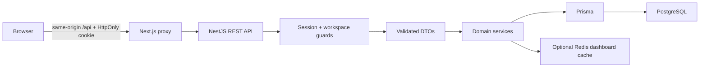

# ForgeBoard architecture

## Boundaries

ForgeBoard is a pnpm/Turborepo monorepo with independently runnable Next.js and NestJS applications. Shared types describe transport data; they do not expose Prisma models to the browser or replace server-side validation. `packages/config` owns strict TypeScript defaults and lint rules; the web application retains the Next.js ESLint presets. `packages/ui` is source-consumed by Next.js.

Next.js renders the shell and route pages. Client components use TanStack Query for all server data, mutation states, and invalidation. There is no global state library: navigation is in URLs, form state is local, and session/workspace context is derived from the session query. Server routes render no private database data; the client shell checks the session before rendering protected content. The API independently enforces every access decision.

## Data model

| Model           | Responsibility                                                          |
| --------------- | ----------------------------------------------------------------------- |
| User            | Fictional/demo identity and display profile                             |
| Workspace       | Tenant boundary                                                         |
| WorkspaceMember | Unique workspace/user membership and role metadata                      |
| Project         | Tenant-owned project, description, color, soft archive                  |
| Board           | One board per project; version row serializes task writes               |
| Column          | Ordered board status, explicit completion flag                          |
| Task            | Column-owned task with title, description, priority, due date, position |
| TaskAssignee    | Composite task/member association with UUID foreign keys                |
| Comment         | Task discussion with author ownership                                   |
| Activity        | Immutable action history with actor and readable message                |

Entity IDs are UUIDs. Membership and assignment uniqueness is enforced in SQL. Foreign keys and explicit deletion policies preserve relational integrity; deleting a task removes its comments/assignments and nulls historical activity task references. Project deletion cascades its board structure. Activity retains creation time only because it is immutable; mutable records have creation/update timestamps. Dates and activity timestamps are returned as ISO strings.

Prisma schema and a checked-in SQL migration live in `apps/api/prisma`. The singleton Prisma service owns client lifecycle. The seed creates deterministic fictional workspaces transactionally, and skips existing workspace slugs to preserve edits. There is no destructive reset script.

## Tenancy and authentication

`AuthGuard` validates an HMAC signature and expiry, then checks that the user still exists. `WorkspaceGuard` resolves membership using the signed user ID and route workspace ID. Controllers do not accept a client-provided acting user ID. All project/task lookups include workspace scope. Assignees must be members of the same workspace; task moves cannot cross project boards. Comment deletion checks the actor against the author.

Roles are stored for future evolution but do not yet restrict member editing: every member can collaborate. No claim is made of a production authorization policy, database row-level security, or independent visitor accounts.

Public demo login is opt-in via `DEMO_AUTH_ENABLED=true` and only resolves the fixed seeded Alex identity. Sessions last eight hours, use HttpOnly/SameSite cookies, and use Secure cookies in production. Session secrets are required and the example placeholder is rejected at startup. Stateless logout removes the cookie, not server-side token state. There is no fake OAuth or password implementation.

All unsafe HTTP methods require the configured browser Origin, including sign-in and logout. Next's same-origin proxy avoids cross-origin cookie complexity. CORS permits the configured origin with credentials. API responses use `Cache-Control: no-store`; internal Redis caching is separate from HTTP caching. API errors use a consistent `{ statusCode, message }` body and do not expose database traces to the browser.

## API surface

All routes have the `/api` prefix. `w` below means `/workspaces/:workspaceId`.

| Method and path                          | Behavior                                            |
| ---------------------------------------- | --------------------------------------------------- |
| `GET /health`                            | Process liveness; no infrastructure guarantee       |
| `POST /auth/demo`                        | Issue demo session cookie                           |
| `GET /auth/session`                      | Current user and authorized workspaces              |
| `POST /auth/logout`                      | Clear session cookie                                |
| `GET w/members`                          | Workspace members and profiles                      |
| `GET w/dashboard`                        | Active projects, tasks, latest workspace activity   |
| `GET/POST w/projects`                    | List including archived / create with default board |
| `GET/PATCH w/projects/:id`               | Board detail / edit, archive, restore               |
| `POST w/tasks`                           | Create task with optional assignments               |
| `GET/PATCH/DELETE w/tasks/:id`           | Detail / edit / delete                              |
| `PATCH w/tasks/:id/move`                 | Move/reorder before an optional task ID             |
| `GET/POST w/tasks/:id/comments`          | List / create task comments                         |
| `DELETE w/tasks/:id/comments/:commentId` | Delete own comment                                  |

Auth, Workspaces, Projects, Tasks, and Database are NestJS modules. Cache is a small shared service. DTOs trim titles, enforce lengths, UUIDs, enums, valid dates, unique assignees, and reject unknown fields. Nullable dates are distinct from omitted updates. A global filter maps expected HTTP and database errors.

## Board writes and activity

Task creation, edits, deletion, comments, and moves use database transactions. Updating the board version acquires a row lock, serializing operations for that board. Reordering reads the task list after acquiring the lock and persists contiguous integer positions. It uses a `beforeTaskId` anchor rather than trusting stale browser indexes. Cross-board moves and unavailable anchors are rejected. The list uses a stable ID tie-breaker.

The frontend optimistically updates the board cache, disables further moves during that request, rolls back on error, and refetches after completion. Native drag-and-drop covers desktop; visible status selectors and up/down buttons also work without dragging. This is a small-board demo design: reorder cost is linear in column size and concurrent edits use last-write-wins, not collaborative conflict resolution.

Activity is recorded in the same transaction as each mutation. Task detail returns its latest 50 activity events; the dashboard returns the latest 12 workspace events. Comments and task details are persisted, not local mocks. Archived project task mutations are rejected; restoring the project allows editing again.

## Redis and query caches

Redis has one responsibility: caching the workspace-wide dashboard response at `dashboard:<workspaceId>` for 20 seconds. It contains only data available to members of that workspace; membership checks happen before a cache read. The frontend derives personal assignments from the shared response. Every project/task/comment mutation invalidates the workspace key after commit.

If Redis cannot connect, reads use PostgreSQL and writes skip cache operations. Connection attempts have a short timeout and retry cooldown. This is a best-effort cache: a failed invalidation or a read/write race can leave stale data until the short TTL expires. It is not an authorization store or source of truth. The client uses workspace-prefixed TanStack Query keys, invalidates them after mutations, and clears its cache on logout.

## User experience

The frontend includes sign-in, workspace overview, projects, project board, and personal-task routes. Overview counts are computed from API data. Search filters active workspace projects/tasks already returned by the dashboard endpoint; it is intentionally small-demo scope, without a separate search engine or unbounded cross-tenant results. Dialogs use native modal focus trapping and Escape handling. Loading, error/retry, empty, pending, and archived states are explicit.

## Verification and limitations

API tests exercise health, cookie/session behavior, expiry/tampering, Origin rejection, membership denial, DTO errors, default board creation, foreign assignee rejection, and ordering/activity/cache-invalidation behavior. Isolated tests substitute Prisma rather than requiring containers. Playwright tests exercise the real UI with intercepted API contracts; they are not live database integration tests.

PostgreSQL and Redis run through local-only Docker ports and named volumes. Both applications run on the host. Build does not connect to PostgreSQL; Prisma is generated before API compilation. Local runtime requires migrations, seed, and a valid session secret. Redis failure is nonfatal. Production deployment, independent identity, rate limiting, pagination, observability, WebSockets, CI, payments, and AI remain outside this demo step.
